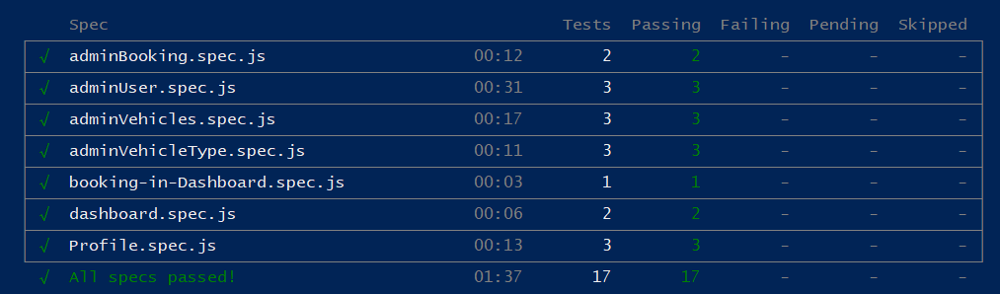

[](https://www.h-da.de/ "Hochschule Darmstadt")

🏛 [Fachbereich Informatik](https://fbi.h-da.de/ "Fachbereich Informatik") - [Hochschule Darmstadt](https://www.h-da.de/ "Hochschule Darmstadt")
<br><br>

# 🚩 [FWE:](https://obs.fbi.h-da.de/mhb/modul.php?nr=30.2566&sem=20202 "Fortgeschrittene Webentwicklung - Modulbeschreibung") BRETSCH - Your booking system for e-vehicles

   

## Table of content

* [📋 About the project](#-about-the-project)
  + [👥 Development](#-development)
* [🛠 Setup the project](#-setup-the-project)
* [🔍 Test the project](#-test-the-project)
  + [Testing automatically](#1-testing-automatically)
  + [Testing manually](#2-testing-manually)
* [💡 Frontend Reference](#-frontend-reference)
* [🖥️ API Reference](#%EF%B8%8F-api-reference)
  + [Route `/booking`](#route-booking)
  + [Route `/user`](#route-user)
  + [Route `/vehicle`](#route-vehicle)
  + [Route `/vehicletype`](#route-vehicletype)
* [⚠ Status codes](#-status-codes)
* [© License](#-license)

# 📋 About the project

Did you ever have some concerns about air pollution but did not know how you could help? If you did then stop using vehicles which generate a lot of CO2 emissions and start <span style="color:#5CE533">*BRETSCHing*</span> with our new models of E-vehicles.

At the moment you can book either an E-car or an E-scooter for a fair price. Get yourself a vehicle on the fly through our website [app.bretsch.eu](http://app.bretsch.eu). Pick up any vehicle in your vicinity and drop it off at any parking lot.

We are developing company from Germany and in the future we are planing to deliver our services worldwide. Start <span style="color:#5CE533">*BRETSCHing*</span> to save the earth.


## 👥 Development

The participants or contributors of this project include:

🎓 **Cimpoes, Vitali**
GitLab: [@istvicimp](https://code.fbi.h-da.de/istvicimp "@istvicimp")<br>

🎓 **Cincato, Ricardo**
GitLab: [@istricinc](https://code.fbi.h-da.de/istricinc "@istricinc")<br>

🎓 **Heymel, Celine**
GitLab: [@istceheym](https://code.fbi.h-da.de/istceheym "@istceheym")<br>

🎓 **Vogel, Eliah**
GitLab: [@istelvoge](https://code.fbi.h-da.de/istelvoge "@istelvoge")<br>

🎓 **Walther, Ramon**
GitLab: [@istrawalt](https://code.fbi.h-da.de/istrawalt "@istrawalt")<br>

🎓 **Werner, Niklas**
GitLab: [@istnswern](https://code.fbi.h-da.de/istnswern "@istnswern")<br>

_This project is kindly supervised by T. Sauer / D. Schulz / D. Wohlfarth._

# 🛠 Setup the project

There is barley nothing easier than setting up this project. Just follow this 3 steps and you're ready to go:

1. Move over to the `bretsch-app/bretsch-api/` folder and create a `.env` file based on the `.env.example`. For default values use the `.env.dist` as base. After that repeat this process for the `bretsch-app/bretsch-frontend/` folder. Finally mve over to the `bretsch-app/bretsch-socket-server/` folder and create a `.env` file based on the `.env.example`.
2. Now head back to the root folder and execute the following command:


   ```
   make start
   ```

   Alternatively if you can't use `make` , run:


   ```
   docker-compose up
   ```

   ❗ **IMPORTANT:** If you run in any errors concerning the `entrypoint.sh` files, download the git project as zip and copy entrypoint.sh from the downloaded zip file to the corresponding folders. There are three scripts which have to be replaced: [/bretsch-app/bretsch-api/entrypoint.sh](/bretsch-app/bretsch-api/entrypoint.sh), [/bretsch-app/bretsch-frontend/entrypoint.sh](/bretsch-app/bretsch-frontend/entrypoint.sh), [ /bretsch-app/bretsch-socket-server/entrypoint.sh](/bretsch-app/bretsch-socket-server/entrypoint.sh). This results in a new creation of the files but with the necessary permissions to run them.

   **Note:** In some cases, the creation of the DB docker is slower than the API docker. This is resulting in the API docker failing to connect to the DB and automatically synchronies the db schema. If this is the case, make sure to restart the project or execute the following command manually as soon as the db is up and running:


   ```
   make dbsync
   ```

   Alternatively if you can't use `make` , run:


   ```
   docker-compose exec bretsch-api npm run typeorm schema:sync
   ```

3. Thats it, your done, it's as simple as that! Your servers should be running now and got a working connection to the DB. You can verify this by checking the console output, which should tell you something like this:


   ```
   You can now view bretsch-frontend in the browser.

      Local:            http://localhost:80
      On Your Network:  http://172.18.0.3:80
   ```

   **Note:** The build process of the frontend could take a few minutes, so please be patient.

Oh and by the way, if you're willing to stop the running server ever again, try executing the following command at the root dir:

```
make stop
```

Alternatively if you can't use `make` , run:

```
docker-compose down
```

## Alternative Docker setting

In some cases the docker script is not working properly.

Replace in the ` `  ` command `  `  ` -field of the .yml file in the images ` bretsch-api ` and ` bretsch-frontend`

that it look like the following:

```
command: npm start
```

Next you just have to setup the images like the following:

**Create the .env file like eplained aboth**

**Install npm packages**

* `docker-compose run [image name] npm install`

In this case the image name will be `bretsch-api` and `bretsch-frontend`

**Start containers**

* `docker-compose up` / `docker-compose up -d`

**Sync database schema**

* `docker-compose exec bretsch-api npm run typeorm schema:sync`

**Insert fixtures**

* `docker-compose exec bretsch-api npm run fixtures`

# 🔍 Test the project

So we included two separate options for you to test the project:

## 1. Testing automatically

This project includes defined automated tests (using jest and cypress). This helps you testing the project easily without spending hours and hours to check every existing route and functionality manually. The already defined api tests are used to test **every single route** for a minimum of a good and bad path. The frontend tests include component as well as E2E tests.

To run all tests, you have to simply start the servers and execute the following command at the root dir:

```
make test
```

Alternatively if you can't use `make` , run:

```
docker-compose exec bretsch-api npm run test
docker-compose exec bretsch-frontend npm run test
```

Depending on the system you're running the tests on, this takes up to a couple of minutes. After that, you're ending up with a detailed overview of the code coverage (_which should be at 100%!_) and the result of the executed tests (_which should tell you that all tests were passed successfully_) for the backend. Followed by the test results of the frontend jest tests.


To start the cypress test environment execute the following command at the root dir:

```
make cypress
```

Alternatively if you can't use `make` , move over to the `bretsch-app/cypress/` folder and run:

```
npm i
npm run cypress
```

### Specify what part to test:

If you just want to run the **frontend** tests, execute the following command at the root dir:

```
make ftest
```

Alternatively if you can't use `make` , run:

```
docker-compose exec bretsch-frontend npm run test
```

And if you just wanna run the **backend** tests, execute the following command at the root dir:

```
make btest
```

Alternatively if you can't use `make` , run:

```
docker-compose exec bretsch-api npm run test
```
We could not test the booking of a vehicle in the frontend. For this we need to click the label on the map which is not possible and then also pay it with paypal which is also not possible. Because of this we tested it by hand to make sure our customers are able to book and pay properly.
We also could not delete bookings with cypress. Cypress is not able to click this button. It is not in the dom at all in the test environment but it is on the normal Website and the delete button also works fine.
After all the frontend tests runed and passed, we deployed them on the ci/cd. Every time we runned it, different tests failed, even if we didn´t changed the code at all. We are not sure why the pipeline is not working. In the folowing picture you can see all tests passing on our local computer.



## 2. Testing manually

If you willing to test the project, especially the backend, manually or wanna test a specific - not in the predefined test included - case, we recommend using the free and easy to use software [Postman](https://www.postman.com/). We also included all routes with a simple examples in our [Postman Collection](bretsch-app/bretsch-api/doc/postman/Bretsch-Backend.postman_collection.json) we're providing with this project. So feel free to test as much as you want, but keep in mind at some point you're going to run out of coffee!

Note that the predefined postman collection is based on the fixtures also delivered with the project. To add this example fixtures to your database simple execute the following command at the root dir:

```
make fixtures
```

Alternatively if you can't use `make` , run:

```
docker-compose exec bretsch-api npm run fixtures
```

# 💡 Frontend Reference

This is a short introduction to the essential functions as well as to some special features. But for most parts, the frontend is very user friendly and self-explanatory. So we keep this Reference kinda short by purpose. Well, then lets start already!

[Little Frontend Guide](doc/frontend_reference/frontend_ref.md)

Okay, so that should be enough for now. As we said, the rest is super easy to understand and shouldn't pose any major difficulties. But If it does, feel free to contact us!

# 🖥️ API Reference

This is a simple overview of all routes provided by the API, grouped by their routers and sorted alphabetically.

**Note:** For further information's including examples on each route, just click their method descriptions.

## Route `/booking`

| Method                                                                                     | URL                              |
| ------------------------------------------------------------------------------------------ | -------------------------------- |
| [Create booking](doc/api_reference/booking/createBooking.md)       | `POST /api/booking/` |
| [Delete booking by id](doc/api_reference/booking/deleteBooking.md) | `DELETE /api/booking/:bookingId` |
| [Get booking by id](doc/api_reference/booking/getSpecificBooking.md)       | `GET /api/booking/:bookingId` |
| [Get bookings](doc/api_reference/booking/getAllBookings.md)           | `GET /api/booking/` |
| [Patch booking by id](doc/api_reference/booking/updateBooking.md)   | `PATCH /api/booking/:bookingId` |

## Route `/user`

| Method                                                                                     | URL                              |
| ------------------------------------------------------------------------------------------ | -------------------------------- |
| [Register user](doc/api_reference/user/registerUser.md)       | `POST /api/user/` |
| [Login user](doc/api_reference/user/loginUser.md)       | `POST /api/user/token` |
| [Validate password](doc/api_reference/user/validatePassword.md)       | `POST /api/user/checkpwd` |
| [Delete user by id](doc/api_reference/user/deleteUser.md) | `DELETE /api/user/:userId` |
| [Get user by id](doc/api_reference/user/getSpecificUser.md)       | `GET /api/user/:userId` |
| [Get users](doc/api_reference/user/getAllUser.md)           | `GET /api/user/` |
| [Check if email exists](doc/api_reference/user/checkMailExists.md)       | `GET /api/user/email/:email` |
| [Get bookings by userId](doc/api_reference/user/getBookingsByUserId.md)       | `GET /api/user/:userId/bookings` |
| [Patch user by id](doc/api_reference/user/updateUser.md)   | `PATCH /api/user/:userId` |

## Route `/vehicle`

| Method                                                                                     | URL                              |
| ------------------------------------------------------------------------------------------ | -------------------------------- |
| [Create vehicle](doc/api_reference/vehicle/createVehicle.md)       | `POST /api/vehicle/` |
| [Delete vehicle by id](doc/api_reference/vehicle/deleteVehicle.md) | `DELETE /api/vehicle/:vehicleId` |
| [Get vehicle by id](doc/api_reference/vehicle/getSpecificVehicle.md)       | `GET /api/vehicle/:vehicleId` |
| [Get vehicles](doc/api_reference/vehicle/getAllVehicles.md)           | `GET /api/vehicle/` |
| [Get all bookings by vehicleId](doc/api_reference/vehicle/getAllBookingsByVehicleId.md)           | `GET /api/vehicle/:vehicleId/bookings` |
| [Patch vehicle by id](doc/api_reference/vehicle/updateVehicle.md)   | `PATCH /api/vehicle/:vehicleId` |

## Route `/vehicletype`

| Method                                                                                     | URL                              |
| ------------------------------------------------------------------------------------------ | -------------------------------- |
| [Create vehicle type](doc/api_reference/vehicleType/createVehicleType.md)       | `POST /api/vehicletype/` |
| [Delete vehicle type by id](doc/api_reference/vehicleType/deleteVehicleType.md) | `DELETE /api/vehicletype/:vehicleTypeId` |
| [Get vehicle type by id](doc/api_reference/vehicleType/getSpecificVehicleType.md)       | `GET /api/vehicletype/:vehicleTypeId` |
| [Get all vehicle types](doc/api_reference/vehicleType/getAllVehicleType.md)           | `GET /api/vehicletype/` |
| [Get all vehicles by vehicleTypeId](doc/api_reference/vehicleType/getAllVehiclesByVehicleTypeId.md)           | `GET /api/vehicletype/:vehicleTypeId/vehicles` |
| [Patch vehicle type by id](doc/api_reference/vehicleType/updateVehicleType.md)   | `PATCH /api/vehicletype/:vehicleTypeId` |

# ⚠ Status codes

The following table gives you a simple overview of the used http status codes used by the project and its respective meaning:

| STATUS CODE                 | Description                                                                                                                                   |
| --------------------------- | --------------------------------------------------------------------------------------------------------------------------------------------- |
| `200 OK` | Indicates that the request has succeeded.                                                                                                     |
| `201 Created` | Indicates that the request has succeeded and a new resource has been created as a result.                                                     |
| `204 No Content` | The server has fulfilled the request but doesn't need to return a response body.                                                              |
|                             |
| `400 Bad Request` | The request couldn't be understood by the server due to incorrect syntax. The client **SHOULD NOT** repeat the request without modifications. |
| `404 Not Found` | The server cannot find the requested resource.                                                                                                |
|                             |
| `500 Internal Server Error` | The server encountered an unexpected condition which prevented it from fulfilling the request.                                                |

# © License

**[MIT license](https://opensource.org/licenses/MIT)**

Copyright 2020 - BRETSCH Development Team <<develop@bretsch.eu>>

> Permission is hereby granted, free of charge, to any person obtaining a copy of this software and associated documentation files (the "Software"), to deal in the Software without restriction, including without limitation the rights to use, copy, modify, merge, publish, distribute, sublicense, and/or sell copies of the Software, and to permit persons to whom the Software is furnished to do so, subject to the following conditions:
>
> The above copyright notice and this permission notice shall be included in all copies or substantial portions of the Software.
>
> THE SOFTWARE IS PROVIDED "AS IS", WITHOUT WARRANTY OF ANY KIND, EXPRESS OR IMPLIED, INCLUDING BUT NOT LIMITED TO THE WARRANTIES OF MERCHANTABILITY, FITNESS FOR A PARTICULAR PURPOSE AND NONINFRINGEMENT. IN NO EVENT SHALL THE AUTHORS OR COPYRIGHT HOLDERS BE LIABLE FOR ANY CLAIM, DAMAGES OR OTHER LIABILITY, WHETHER IN AN ACTION OF CONTRACT, TORT OR OTHERWISE, ARISING FROM, OUT OF OR IN CONNECTION WITH THE SOFTWARE OR THE USE OR OTHER DEALINGS IN THE SOFTWARE.
