# Frontend Reference
 
In the following guide you get a quick overview over the use of Bretsch.

## Table of Content
* [The Dashboard Page](#the-dashboard-page)
  + [1 - Map](#user-content-1-the-map)
  + [2 - Active Booking](#user-content-2-active-booking)
  + [3 - The Pricing](#user-content-3-the-pricing)
  + [4 - Login](#user-content-4-login)
  + [5 - Map view of the currently unused vehicles](#user-content-5-map-view-of-the-currently-unused-vehicles)
  + [6 - Filter for specific vehicle types](#user-content-6-filter-for-specific-vehicle-types)
  + [7 - Tiny setting menue](#user-content-7-tiny-setting-menue)
  + [8 - Profile settings](#user-content-8-profile-settings)
  + [9 - All Bookings of one users](#user-content-9-all-bookings-of-one-users)
  + [10 - Log out](#user-content-10-log-out)
* [The Admin Page](#user-content-the-admin-page)
  + [11 - Admin Page](#user-content-11-admin-page)
  + [Vehicle Types](#user-content-vehicle-type)
  + [Vehicles](#user-content-vehicles)
  + [Users](#user-content-users)
  + [Bookings](#user-content-booking)

## The Dashboard Page
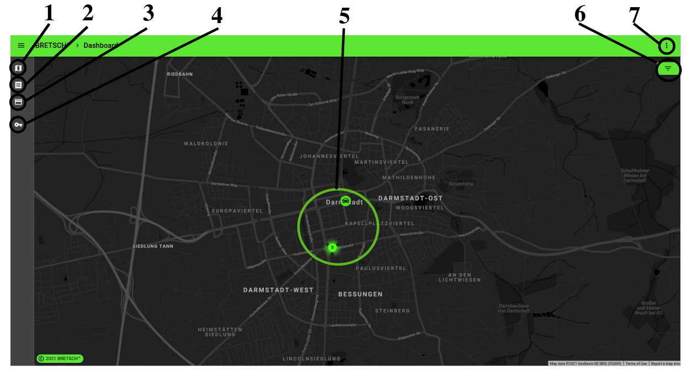
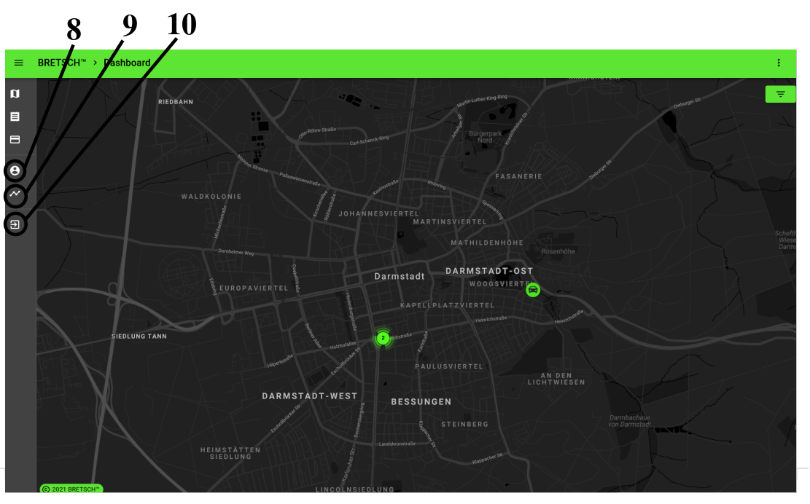

### 1 - The Map
This button directs back to the Dashboard Map.

### 2 - Active Booking
This will direct to the currently running booking of the logged in user. 

**For example**:

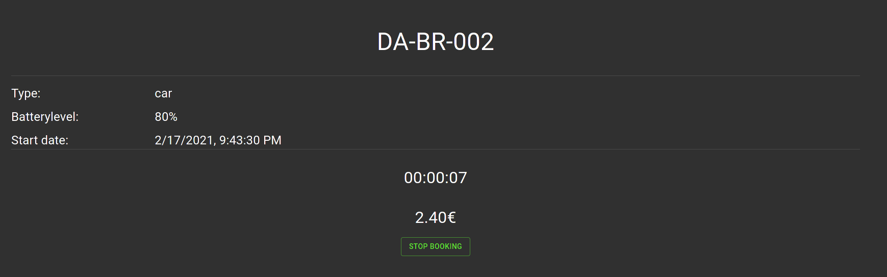

#### Stop Booking
1. Select the pay option (in this project exist a paypal sandbox for testing)

 

2. Pay with the paypal sandbox.  
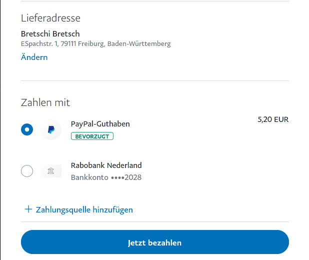

> For test cases exists a fake user paypal account in the sandbox:  
> _user name_: test@bretsch.eu  
> _password_: bretschbretsch!

### 3 - The Pricing
This will show you all pricings of the different vehicle types  

**For example**:

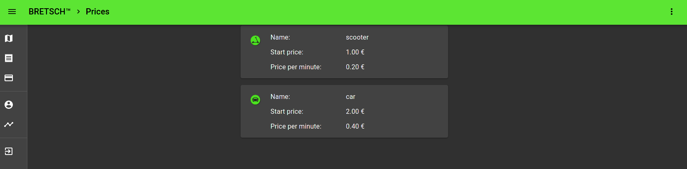

### 4 - Login
This will open a login window to login or register. After successfully logged in, the Meunue will look slightly different (Point [8](#user-content-8-profile-settings), [9](#user-content-9-all-bookings-of-one-users), [10](#user-content-10-log-out)).

**For example**:  
#### Log in
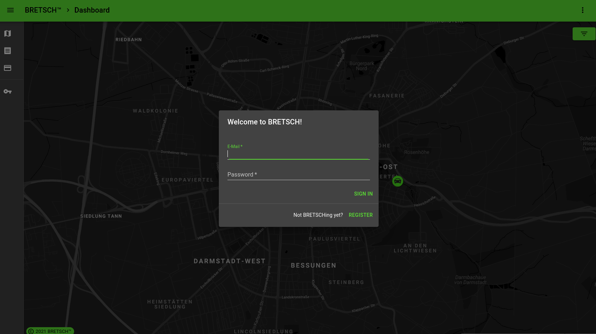

#### Register
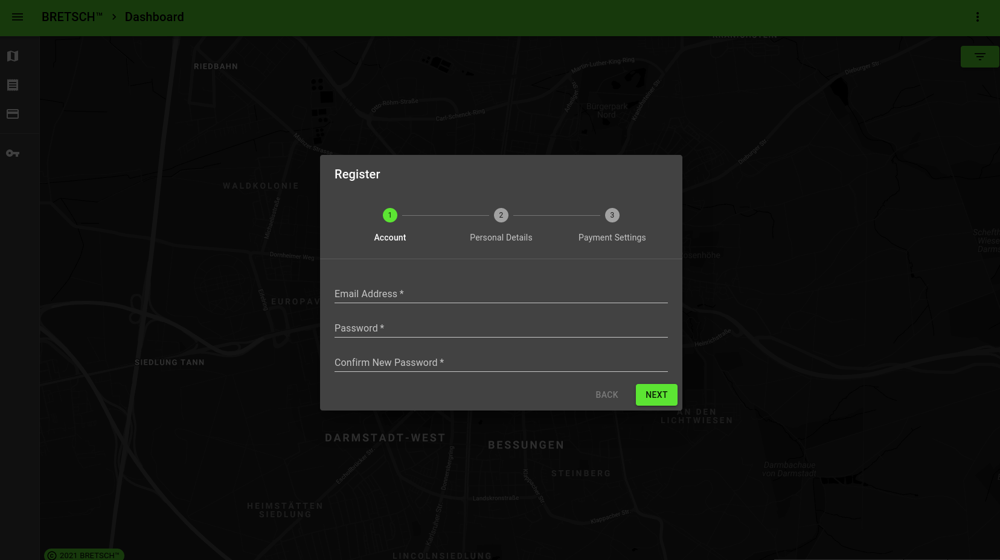

### 5 - Map view of the currently unused vehicles
The map shows the unused vehicles. Vehicles that are near each other will get summarized. If you scroll near enough, they get separated again.

### 6 - Filter for specific vehicle types
This gives you the opportunity to filter the Map by different vehicle types.

### 7 - Tiny setting menue
This menue let you switch between dark and light mode, reload data or clear your data storage.

### 8 - Profile settings
On this site you can edit the profile data of the logged in user.  

**For example**:  

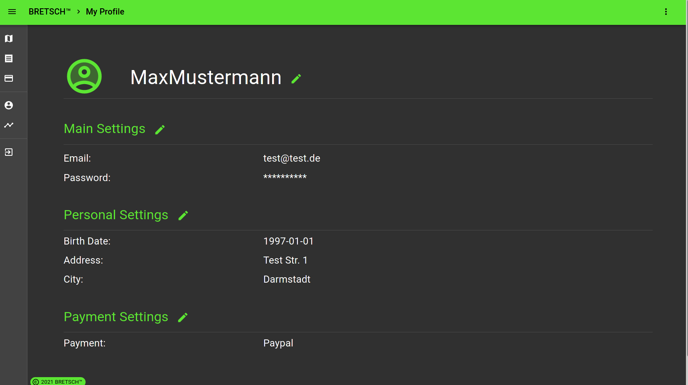

### 9 - All Bookings of one users
On this site you can see all bookings of the logged in user. 

**For example**:  

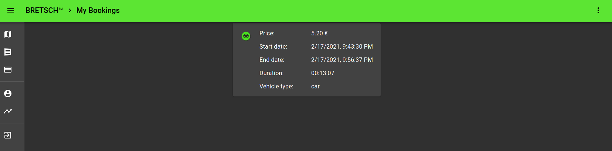

### 10 - Log out
This will log out the user.

## The Admin Page
This page make it possible to see, create, update and delete Vehicle types, Vehicles, Users and Bookings.
This page is accessable for all user with role "admin".  

For test cases exists a admin user in the fixtures
> _E-mail_: user1@bretsch.eu  
> _Password_: bretsch1

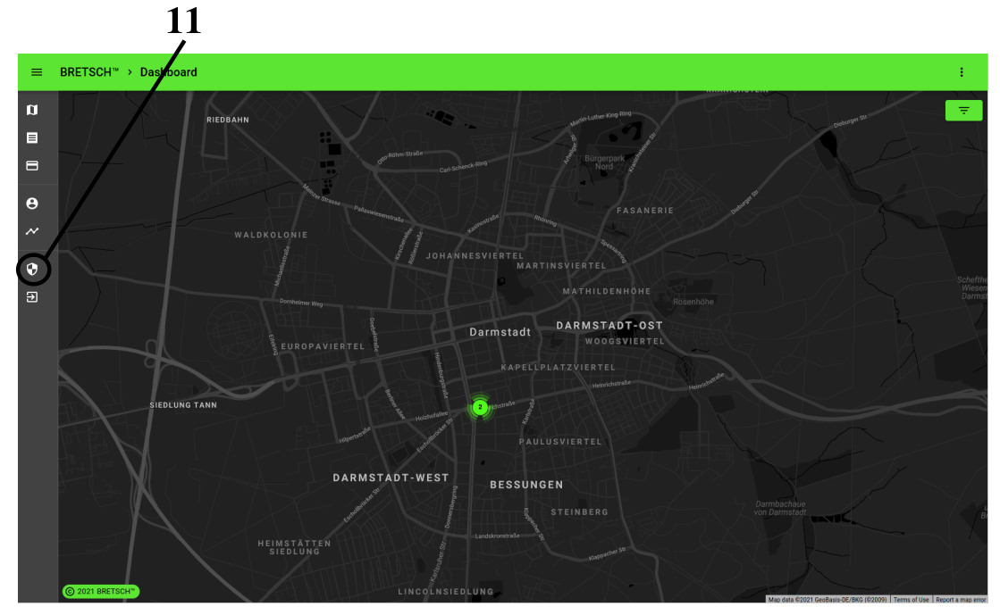
 

### 11 - Admin page
With the right access rights you get the option to enter the Admin page

### Vehicle Type
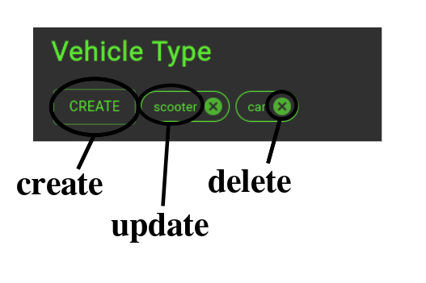
  

**Create**: name, start price, price, minimal battery level  
**Update**: name, start price, price, minimal battery level

### Vehicles
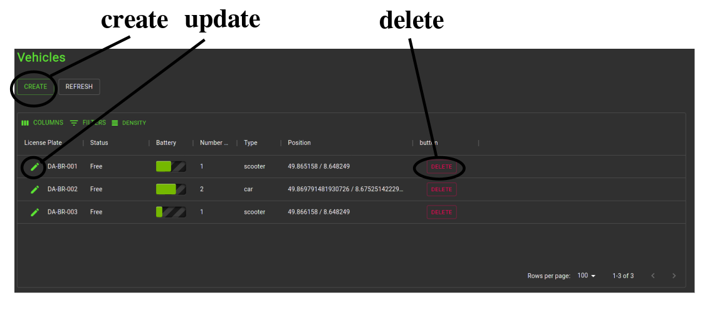
  

**Create**:  Licence Plate (not required (!) - fully generated - 'DA-BR' + number), battery level, status, according vehicle type, longitude (for car position), latitude (for car position) 
_Note_: longitude and latitude are not required. If they are not given, the vehicle gets a random position.

**Update**: Licence Plate (can be fully replaced by an individual licence plate), battery level, status, according vehicle type, longitude (for car position), latitude (for car position) 

### Users
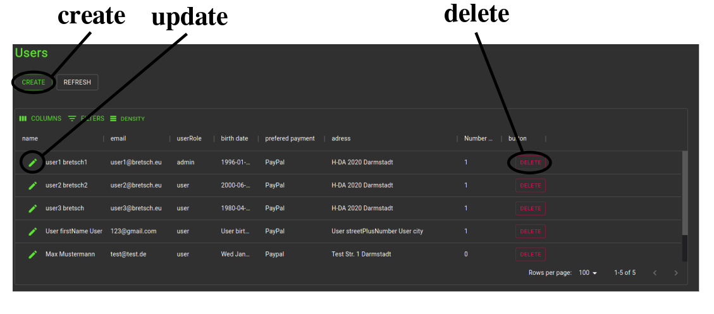
  

**Create**:  email, password, firstname, lastname, birth date, prefered payment, street and streetnumber, city  
**Update**:  email, password, firstname, role, lastname, birth date, prefered payment, street and streetnumber, city  

### Booking
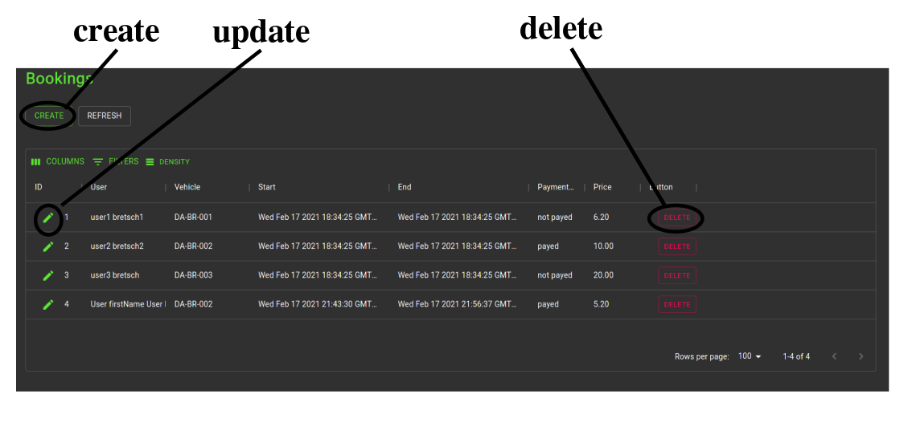
  

**Create**:  payment status, start time (date and time), vehicle, user  
**Update**:  payment status, end time (date and time), price  
